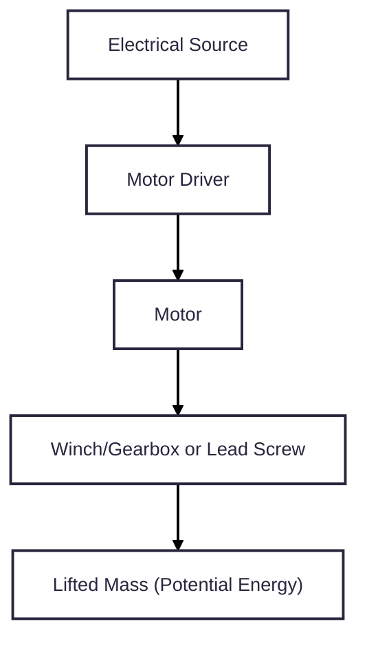
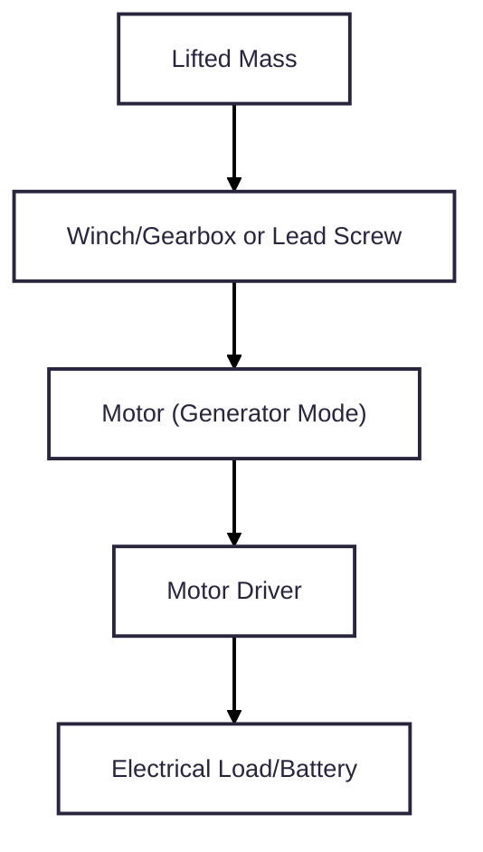
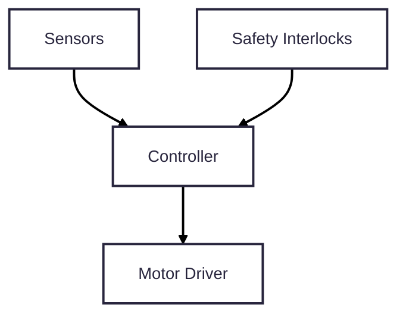

# Design Goal
## Mission Statement
Design and build a lab-scale tower gravity energy storage system capable of storing and releasing mechanical potential energy under automated control while measuring efficiency and ensuring safe operation.
## Non-goals
* not grid-scale
* not optimized for cost
# Engineering Requirements
## Implied Requirements
| Phrase                | Implies                      |
|-----------------------|------------------------------|
| lab-scale             | Size, mass, and power limits |
| tower gravity         | vertical lift, guided mass   |
| energy storage        | measurable stored energy     |
| storing and releasing | bidirectional operation      |
| automated control     | controller and sensors       |
| measuring efficiency  | power and energy measurement |
| safe operation        | redundant safety features    |
## Quantitative System Requirements
| ID  | Requirement            | Target / Constraint    |
|-----|------------------------|------------------------|
| R1  | stored energy capacity | >= 0.25 Wh             |
| R2  | tower height           | <= 0.5 m               |
| R3  | lifted mass            | 150 - 300 kg           |
| R4  | discharge power        | 50 - 200 W             |
| R5  | charge time            | <= 30 s                |
| R6  | automation             | fully automated        |
| R7  | efficiency measurement | required               |
| R8  | safety                 | e-stop and limits      |
| R9  | environment            | indoor lab operation   |
## Acceptance Criteria
| Requirement | Acceptance Test                                         |
|-------------|---------------------------------------------------------|
| R1          | lift mass stores >= 0.25 Wh                             |
| R4          | system delivers >= 50 W to load                         |
| R6          | system completes lift/lower without manual intervention |
| R7          | voltage & current logged at >= 10 Hz                    |
| R8          | efficiency computed from logged data                    |
| R9          | e-stop halts motion within safe distance
# System Architecture
## Subsystem List
1. Structural & Mechanical Subsystem
2. Guided Mass Assembly
3. Lifting & Transmission Subsystem
4. Motor / Generator Subsystem
5. Power Electronics & Energy Conditioning Subsystem
6. Control & Automation Subsystem
7. Sensing & Instrumentation Subsystem
8. Safety & Protection Subsystem
9. User Interface & Data Logging Subsystem
## Energy/Signal Flow Definitions
### Energy Flow (Charge)

### Energy Flow (Discharge)

### Signal Flow

## System Architecture Choices
### Vertical Motion Method
Chose guided vertical mass because of the simple physics, clear energy path, and easy measurement.
### Transmission
Chose lead screw because it gives precise positioning, is self-locking, and compact.
### Motor Type
Chose DC motor with regen because of its bidirectional energy flow.
### Control
Chose microcontroller-based state machine because of the need for automation and safety logic.
# Energy Storage Sizing
## Fixed Stored Energy
Chose 0.049 Wh as target stored energy.
## Discharge Power and Time
30 - 80 W discharge
## Preliminary Force and Torque Numbers
### Lifting Force
$F = mg \approx 392.4 N$
# Vertical Motion and Transmission Method
Vertical lead screw with guided mass because it has lower torque compared to winch and is self-locking when power goes off.
# Structural Frame Design
## Structural Configuration
Proposed geometry is a four-column verticle frame, with columns at the corners of a square, top and bottom plates, central lead screw, and two vertical guide rails.
## Extrusion Size
40 mm x 40 mm aluminum T-slot extrusion due to strength, torsional rigidity, availability, and easy mounting of guides, sensors, and guards.
## Load Path and Forces
Vertical load of 392 N acts downward on the mass, transferring through the nut block, lead screw, top bearing, and frame.
## Frame Height and Cut Lengths
### Vertical Members
- nominal height of 600 mm
### Horizontal Members
- base frame: 400 x 400 mm
- top frame: 400 mm width
### Preliminary Material List
| Member            | Quantity | Length |
|-------------------|----------|--------|
| Vertical Uprights | 4        | 600 mm |
| Base Frame        | 4        | 400 mm |
| Top Frame         | 2        | 400 mm |
## Safety Integration into Structure
- upper limit switch
- lower limit switch
- mechanical hard stops
- polycarbonate guarding
# Lead Screw and Drive Sizing
## Lead Screw Geometry
- Diameter: 16 mm
- Lead: 8 mm/rev
- Thread: ACME
- Length: ~700 mm
## Torque Requirement
$\tau = \frac{F \times lead}{2 \pi \times \eta} = \frac{392 \times 0.008}{2\pi \times 0.035} \approx 1.43 N \cdotp m$​
With safety factor of 2, 
$\tau_{design} = 2.9 N \cdotp m$
## Required Speed
- Linear speed: 0.045 m/s
- Screw speed: $n = \frac{v}{lead} = \frac{0.045}{0.008} = 5.6 rev/s, n \approx 335 RPM$
## Mechanical Power
$P = \tau \omega \approx 50 W$
# Motor Selection and Drive Strategy
## Motor Torque and Speed Requirements
- Design Torque: $3 N \cdotp m$
- Speed: ~ 335 RPM
## Gear Ratio Selection
$G = \frac{target motor speed}{required screw speed} = \frac{2500}{335} \approx 7.5$
So 8:1 gearbox
## Motor Shaft Requirements
$\tau_{motor} = \frac{3}{8} \approx 0.38 N \cdotp m$
Chose motor rated at least $0.6 N \cdotp m$ continuous 
## Motor Specs
| Parameter    | Target          |
|--------------|-----------------|
| Type         | Brushed DC      |
| Voltage      | 24 V            |
| Rated Power  | 75 - 100 W      |
| Rated Speed  | ~ 2500 RPM      |
| Rated Torque | at least 0.6 Nm |
| Gearbox      | 8:1 planetary   |
| Encoder      | Quadrature      |
## Regenerative Operation
1. Mass back-drives lead screw
2. Gearbox back-drives motor
3. Motor acts as generator
4. Energy flows into battery or dump load
# Power Electronics and Energy Flow
## Electrical Architecture
### Charging
DC Power Supply → Motor Driver → DC Motor → Gearbox → Lead Screw → Mass
### Discharging
Mass → Lead Screw → Gearbox → DC Motor (Generator) → Motor Driver → Dump Resistor
## Motor Driver Selection
4-Quadrant DC motor Driver
## Voltage and Current Estimates
### Lift Mode
At 24 V, $I \approx 3 A$
### Regen Mode
$I \approx 1.5-2.5 A$
### Design
- 10 A peak
- 5 A continuous
## Dump Load Design
### Goal
Safely absorb regenerated energy without overheating
### Chosen Resistance
$R = \frac{V}{I} = \frac{24}{2} = 12 \Omega$
### Power Rating
P = VI = 48 W
With safety factor at least 2, 100 W resistor.
# Control And Automation
## Control Objectives
1. Execute automated lift and lower cycles
2. Regulate motor speed
3. Prevent over-travel
4. Manage energy flow
5. Respond to faults and emergency stops
6. Log data for efficiency calculation
## Operating Modes
| Mode           | Description                   |
|----------------|-------------------------------|
| Idle           | System powered, no motion     |
| Lift           | Motor lifts mass              |
| Hold           | Mass held at height           |
| Lower          | Controlled descent with regen |
| Fault          | Error detected                |
| Emergency Stop | Immediate safe stop           |
## State Machine
### State Transitions
Idle -> Lift -> Hold -> Lower -> Idle
### Fault Transitions
- Any State -> Fault
- Any State -> E-Stop
## Speed Control Strategy
Open-loop PWM with current limiting
## Direction and Regeneration Control
- Lift: Forward PWM, positive current
- Lower: Reverse PWM or regen mode
## Safety Interlocks in Control Logic
### Hardware Level
- Emergency Stop
- Limit Switches
### Software Level
- Max current limit
- Max time in motion
- Sensor plausibility checks
# Sensing and Instrumentation
## Sensor Selection
### Position/Height
motor encoder: $h = rev \times lead$
### Voltage Sensor
resistor divider
### Current Sensor
Hall-effect sensor
### Limit Switches
Upper and lower limit switch
## Data Logging Plan
### Logged Variables
At at least 10 Hz:
- Voltage
- Current
- Motor Speed
- Position
- State
### Logging Methods
- Serial output to PC
- SD card module
## Efficiency Measurement Method
### Electrical Energy In
$E_{in} = \int V(t)I(t)dt$
### Mechanical Energy Stored
$E_{stored} = mgh$
### Electrical Energy Out
$E_{out} = \int V(t)I(t)dt$
### Round-Trip Efficiency
$\eta = \frac{E_{out}}{E_{in}}$
# Safety and Protection System
## Hazard Analysis
| Hazard           | Mitigation              |
|------------------|-------------------------|
| Falling Mass     | Self-locking ACME Screw |
| Overtravel       | Limit switches          |
| Electrical Fault | Fuse and E-stop         |
| Software Crash   | Hardware Limits         |
| Overcurrent      | Driver Limits           |
## Emergency Stop
1. Cuts power to motor
2. Disable Driver
3. System enters E-STOP state
4. Manual Reset Required
## Mechanical Hard Stops
If software and limits fail, hard stops prevent damage. 
