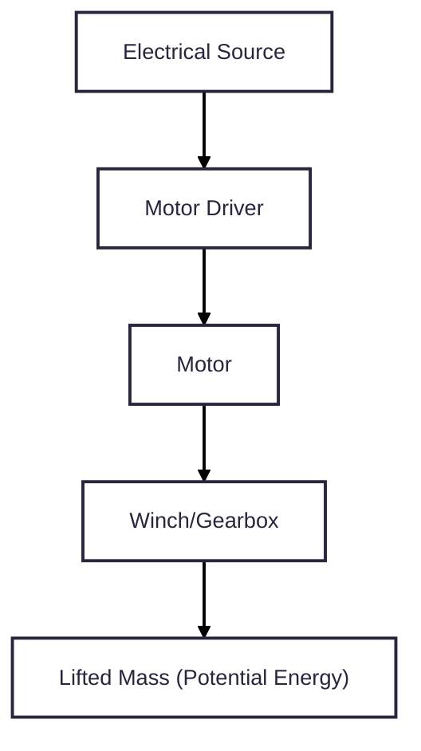
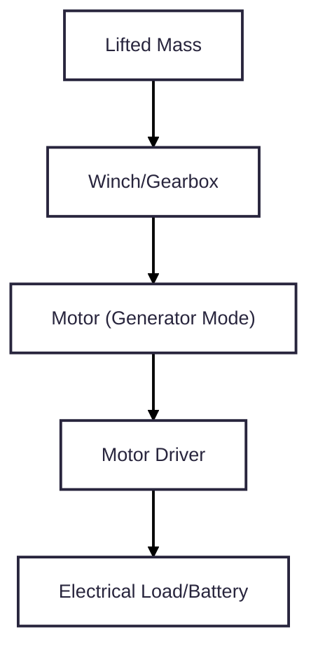
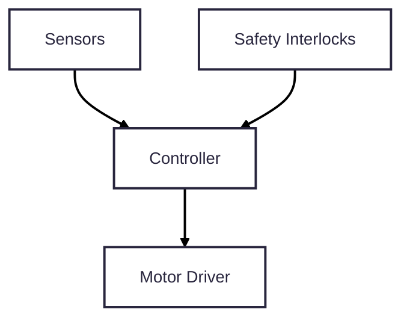

# Design Goal
## Mission Statement
Design and build a lab-scale tower gravity energy storage system capable of storing and releasing mechanical potential energy under automated control while measuring efficiency and ensuring safe operation.
## Non-goals
* not grid-scale
* not optimized for cost
# Engineering Requirements
## Implied Requirements
| Phrase                | Implies                      |
|-----------------------|------------------------------|
| lab-scale             | Size, mass, and power limits |
| tower gravity         | vertical lift, guided mass   |
| energy storage        | measurable stored energy     |
| storing and releasing | bidirectional operation      |
| automated control     | controller and sensors       |
| measuring efficiency  | power and energy measurement |
| safe operation        | redundant safety features    |
## Quantitative System Requirements
| ID  | Requirement            | Target / Constraint    |
|-----|------------------------|------------------------|
| R1  | stored energy capacity | >= 2 Wh                |
| R2  | tower height           | <= 4 m                 |
| R3  | lifted mass            | <= 250 kg              |
| R4  | max discharge power    | 100 - 300 W            |
| R5  | charge time            | <= 2 minutes           |
| R6  | control mode           | fully automated        |
| R7  | measurement            | energy in/out logged   |
| R8  | efficiency calculation | round-trip efficiency  |
| R9  | safety                 | e-stop and hard limits |
| R10 | environment            | indoor lab operation   |
| R11 | budget                 | <= project budget      |
| R12 | reset capability       | repeatable cycles      |
## Acceptance Criteria
| Requirement | Acceptance Test                                         |
|-------------|---------------------------------------------------------|
| R1          | lift mass stores >= 2 Wh                                |
| R4          | system delivers >= 100 W to load                        |
| R6          | system completes lift/lower without manual intervention |
| R7          | voltage & current logged at >= 10 Hz                    |
| R8          | efficiency computed from logged data                    |
| R9          | e-stop halts motion within safe d

    Structural & Mechanical Subsystem

    Lifting & Transmission Subsystem

    Motor / Generator Subsystem

    Power Electronics & Energy Conditioning Subsystem

    Control & Automation Subsystem

    Sensing & Instrumentation Subsystem

    Safety & Protection Subsystem

    User Interface & Data Logging Subsystem
istance                |
# System Architecture
## Revised Energy Requirement
### Updated Requirement
| ID | Updated Requirement     |
|----|-------------------------|
| R1 | stored energy >= 0.5 Wh |
### Justification
Height is limited to 2 m by transportation/budget constraints. Goal is for system to demonstrate principles instead of capacity.
## Subsystem List
1. Structural & Mechanical Subsystem
2. Lifting & Transmission Subsystem
3. Motor / Generator Subsystem
4. Power Electronics & Energy Conditioning Subsystem
5. Control & Automation Subsystem
6. Sensing & Instrumentation Subsystem
7. Safety & Protection Subsystem
8. User Interface & Data Logging Subsystem
## Energy/Signal Flow Definitions
### Energy Flow (Charge)

### Energy Flow (Discharge)

### Signal Flow

## System Architecture Choices
### Vertical Motion Method
Chose guided vertical mass because of the simple physics, clear energy path, and easy measurement.
### Transmission
Chose winch and cable because it is compact, scalable, and cheap.
### Motor Type
Chose DC motor with regen because of its bidirectional energy flow.
### Control
Chose microcontroller-based state machine because of the need for automation and safety logic.
