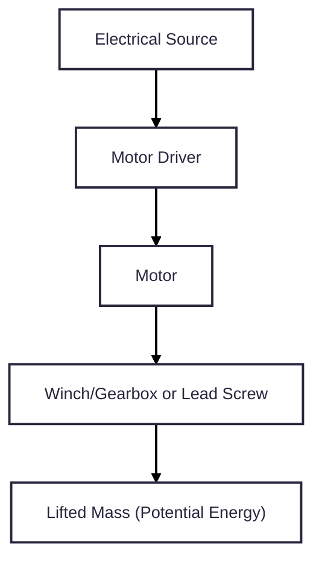
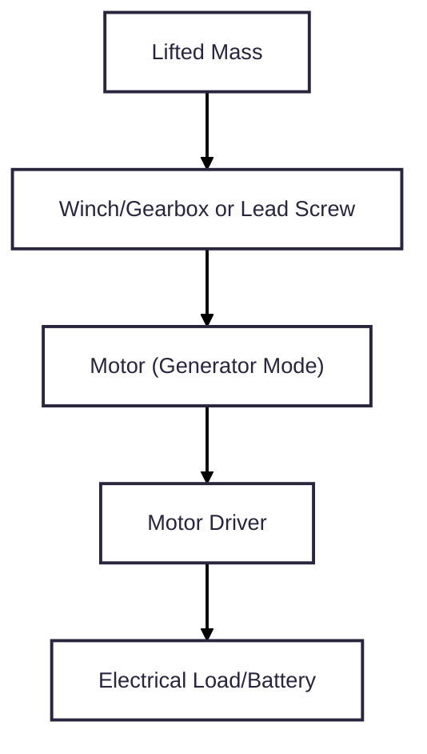
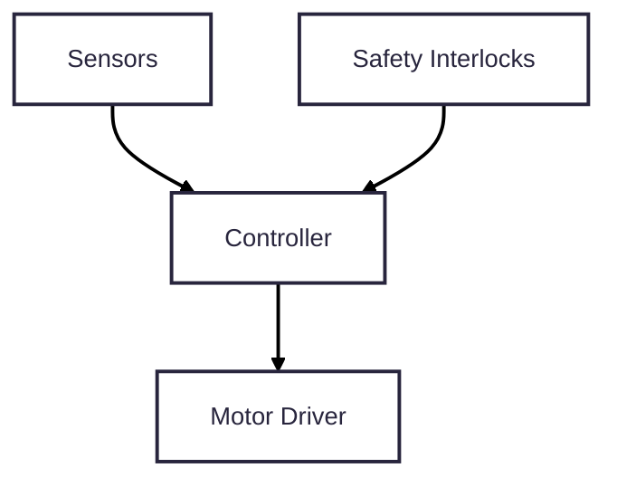

# Design Goal
## Mission Statement
Design and build a lab-scale tower gravity energy storage system capable of storing and releasing mechanical potential energy under automated control while measuring efficiency and ensuring safe operation.
## Non-goals
* not grid-scale
* not optimized for cost
# Engineering Requirements
## Implied Requirements
| Phrase                | Implies                      |
|-----------------------|------------------------------|
| lab-scale             | Size, mass, and power limits |
| tower gravity         | vertical lift, guided mass   |
| energy storage        | measurable stored energy     |
| storing and releasing | bidirectional operation      |
| automated control     | controller and sensors       |
| measuring efficiency  | power and energy measurement |
| safe operation        | redundant safety features    |
## Quantitative System Requirements
| ID  | Requirement            | Target / Constraint    |
|-----|------------------------|------------------------|
| R1  | stored energy capacity | >= 0.25 Wh             |
| R2  | tower height           | <= 0.5 m               |
| R3  | lifted mass            | 150 - 300 kg           |
| R4  | discharge power        | 50 - 200 W             |
| R5  | charge time            | <= 30 s                |
| R6  | automation             | fully automated        |
| R7  | efficiency measurement | required               |
| R8  | safety                 | e-stop and limits      |
| R9  | environment            | indoor lab operation   |
## Acceptance Criteria
| Requirement | Acceptance Test                                         |
|-------------|---------------------------------------------------------|
| R1          | lift mass stores >= 0.25 Wh                             |
| R4          | system delivers >= 50 W to load                         |
| R6          | system completes lift/lower without manual intervention |
| R7          | voltage & current logged at >= 10 Hz                    |
| R8          | efficiency computed from logged data                    |
| R9          | e-stop halts motion within safe distance
# System Architecture
## Subsystem List
1. Structural & Mechanical Subsystem
2. Guided Mass Assembly
3. Lifting & Transmission Subsystem
4. Motor / Generator Subsystem
5. Power Electronics & Energy Conditioning Subsystem
6. Control & Automation Subsystem
7. Sensing & Instrumentation Subsystem
8. Safety & Protection Subsystem
9. User Interface & Data Logging Subsystem
## Energy/Signal Flow Definitions
### Energy Flow (Charge)

### Energy Flow (Discharge)

### Signal Flow

## System Architecture Choices
### Vertical Motion Method
Chose guided vertical mass because of the simple physics, clear energy path, and easy measurement.
### Transmission
Chose lead screw because it gives precise positioning, is self-locking, and compact.
### Motor Type
Chose DC motor with regen because of its bidirectional energy flow.
### Control
Chose microcontroller-based state machine because of the need for automation and safety logic.
# Energy Storage Sizing
## Fixed Lift Height
Total tower height is 0.5 m, but usable lift height is only 0.45 m to allow for top and bottom clearances, mechanical stops, sensor mounting, and safety margin.
## Fixed Stored Energy
Chose 0.049 Wh as target stored energy.
## Discharge Power and Time
30 - 80 W discharge
## Preliminary Force and Torque Numbers
### Lifting Force
$F = mg \approx 392.4 N$
# Vertical Motion and Transmission Method
Vertical lead screw with guided mass because it has lower torque compared to winch and is self-locking when power goes off.
# Structural and Mechanical Design
## Tower Geometry and Material Choice
Ideal structural material is Aluminum T-slot extrusion because it is modular and adjustable, easy to assemble and modify, and adequately strong for 115 kg.
Proposed geometry is a four-column verticle frame, with columns at the corners of a square and cross-bracing at base and mid-height.
### Dimensions
| Parameter          | Value         |
|--------------------|---------------|
| Total height       | 2 m           |
| Usable lift height | 1.6 m         |
| Base footprint     | 0.6 m x 0.6 m |
## Load Calculations with FoS
### Static Load
$F_{static} = mg = 115 \times 9.81 \approx 1130 N$
### Dynamic Load
$F_{design} \approx 1.5 \times F_{static} \approx 1700 N$
### Load Distribution
$F_{per column} \approx 425 N$
## Base and Anchoring Concept
A steel or aluminum plate, weighted, with rubber feet since floor bolts are not allowed.
## Lifted Mass Design
115 kg +/- 5 kg steel plates stacked and bolted or concrete block in steel cage with secure attachment point and compact vertical profile.
## Guidance System Selection
Linear rails to prevent swing, reduce cable shock, and improve safety and measurement repeatability
## Mechanical Stops and Safety Margins
Hard lower and upper stops for absorbing full load and preventing over travel, respectively. Clearance before top of structure.
# Lifting and Transmission Design
## Winch Geometry
Single-drum winch with radius 50 mm
## Cable Selection and Rating
Galvanized steel wire rope with 4 - 6 mm diameter and 7 x 19 construction
## Torque, Speed, and Power Requirements
### Required Winch Torque
$\tau = F \times r = 1700 \times 0.05 \approx 85 N \cdotp m$
Motor and gearbox must provide at least 85 Nm continuous torque at the winch.
### List Speed Selection
0.1 m/s lift speed
time to full lift is $t = \frac{1.6}{0.1} = 16 s$
### Mechanical Power During Lift/Lower
$P = F \times v$
$P = 1130 \times 0.1 \approx 113 W$
With losses, need about 150 W electrical system.
## Braking Concept
Spring-applied, electrically released brake on motor shaft that engages automatically on power loss, holds load at any height, and can be made very safe.
# Motor / Generator & Gearbox Selection
## Winch angular speed
$\omega = \frac{v}{r} = \frac{0.1}{0.05} = 2 \frac{rad}{s}$.
$RPM = \frac{2 \times 60}{2\pi} \approx 19 RPM$.
The winch must turn at ~20 RPM under load.
## Gearbox Ratio Selection
### Target Motor Speed Choice
~2000 RPM under load
### Required Gear Reduction
$G = \frac{2000}{20} = 100: 1$
## Required Motor Torque
$\tau_{motor} = \frac{\tau_{winch}}{G}$.
$\tau_{motor} = \frac{85}{100} = 0.85 N \cdotp m$.
Assuming gearbox efficiency of ~85%,
$\tau_{motor, req} \approx 1.0 N \cdotp m$.
## Motor Power Rating
$P = \tau \omega$.
$2000 RPM = 209 \frac{rad}{s}$.
$P = 1.0 \times 209 \approx 209 W$
### Motor Rating Selection
Rated power of 250-300 W
Voltage of 24V of 48V
Continuous torque of at least 1.0 $N \cdotp m$
## Regenerative Operation
Brushed DC motors naturally generate voltage when driven.
### Requirements
- Motor driver must support bidirectional current
- DC bus must absorb regenerated energy
## Motor Brake Integration
Normally-closed mechanical brake installed on motor shaft or gearbox output that holds load when power is lost and engages during emergency stop.
# Power Electronics and Energy Conditioning
## Electrical Architecture Definition
- DC bus based system
- Brushed DC motor connected by 4-quadrant motor driver
- Battery connected to DC bus 
## DC Bus Voltage Selection
24 V DC
## Motor Driver Selection
- 4-quadrant operation
- Voltage at least 24 V
- Continuous current at least 15 A
- Current sensing output
$P = VI$.
$I = \frac{250}{24} \approx 10.4 A$.
## Battery Selection
### Battery Type
Lithium-ion
### Capacity Requirements
24 V, 2 Ah
## Battery Protection and Interface
- Battery Management System
- Fuse near battery terminal
- Contactor or power switch
## Regen Voltage Control
1. Battery absorbs energy
2. Motor driver limits regen current
# Control And Automation
## Control Objectives
1. Execute automated lift and lower cycles
2. Regulate motor speed
3. Prevent over-travel
4. Manage energy flow
5. Respond to faults and emergency stops
6. Log data for efficiency calculation
## Operating Modes
| Mode           | Description                   |
|----------------|-------------------------------|
| Idle           | System powered, no motion     |
| Lift           | Motor lifts mass              |
| Hold           | Mass held at height           |
| Lower          | Controlled descent with regen |
| Fault          | Error detected                |
| Emergency Stop | Immediate safe stop           |
## State Machine
### State Transitions
Idle -> Lift -> Hold -> Lower -> Idle
### Fault Transitions
- Any State -> Fault
- Any State -> E-Stop
## Speed Control Strategy
Open-loop PWM with current limiting
## Direction and Regeneration Control
- Lift: Forward PWM, positive current
- Lower: Reverse PWM or regen mode
## Safety Interlocks in Control Logic
### Hardware Level
- Emergency Stop
- Limit Switches
### Software Level
- Max current limit
- Max time in motion
- Sensor plausibility checks
# Sensing and Instrumentation
## Position and Travel Sensing
### Selected Sensors
- Upper limit switch
- Lower limit switch
### Placement
- Upper switch slightly below mechanical top stop
- Lower switch slightly above mechanical bottom stop
## Electrical Measurements
### Voltage Measurement
- Battery voltage by resistor divider
- ADC input on Arduino
### Current Measurement
- Hall-effect current sensor
### Required Performance
| Parameter        | Value    |
|------------------|----------|
| Voltage accuracy | +/- 2-3% |
| Current range    | +/- 20 A |
| Sample rate      | >= 10 Hz |
## Efficiency Measurement Method
### Electrical Energy In
$E_{in} = \int V(t)I(t)dt$
### Electrical Energy Out
$E_{out} = \int V(t)I(t)dt$
### Round-Trip Efficiency
$\eta = \frac{E_{out}}{E_{in}}$
## Data Logging Plan
### Logged Variables
- Time
- Battery voltage
- Motor current
- State
- Limit switch status
### Logging Methods
- Serial output to PC
- SD card module
- Onboard flash
# Safety and Protection System
## Hazard Analysis
| Hazard               | Cause                        |
|----------------------|------------------------------|
| Falling mass         | Cable failure, brake failure |
| Uncontrolled descent | Power loss, driver fault     |
| Pinch/crush points   | Moving mass and winch        |
| Electrical Shock     | Battery, exposed terminals   |
| Unexpected Motion    | Software bug, EMI            |
## Layered Safety Strategy
Defense in depth:
1. Mechanical safety
2. Hardware safety
3. Electrical safety
4. Software safety
## Mechanical Safety Features
### Normally-Closed Mechanical Brake
Holds the mass at any height, indefinitely.
### Mechanical Hard Stops
Hard stops must withstand full mass and dynamic load.
### Guided Mass
## Hardware Safety Systems
### Emergency Stop
Mushroom-style, latching, normally closed.
1. Cuts power to motor driver
2. De-energizes brake → brake engages
3. System enters E-STOP state
E-stop bypasses the MCU entirely.
### Limit Switches
## Electrical Safety
### Battery Protection
- Battery Management System
- Inline fuse near battery terminal
- Insulated connectors
### Wiring Practices
- Strain relief on moving cables
- No exposed high-current terminals
- Grounded metal structure
## Software Safety
### Software Safety Checks
- Max current threshold
- Max motion time
- Invalid state transitions
- Sensor plausibility checks
### Fault Behavior
1. Motor command becomes zero
2. Brake engages
3. System enters FAULT state
4. Manual reset required
## Guarding and Operator Safety
### Required Physical Measures
- Clear polycarbonate guarding around:
      Moving mass,
      Winch and cable
- Warning labels
- Clearly marked safe zones
### Operational Rules
- No hands inside guarding during motion
- One operator at controls
- Supervisor present during testing
# User Interface and Data Logging
## UI Objectives
1. Command system states
2. Display live system status
3. Visualize power and energy
4. Log data for post-processing
5. Support safe, supervised operation
## PC-MCU Communication Architecture
USB Serial Communication
## Data Logging Strategy
### Logged Variables
| Variable            | Purpose       |
|---------------------|---------------|
| Timestamp           | Integration   |
| State               | Context       |
| Battery Voltage     | Energy        |
| Motor Current       | Energy        |
| Calculated Power    | Visualization |
| Limit Switch Status | Verification  |
### Logging Rate
10-50 Hz
## Efficiency Calculation Workflow
### On Arduino
Stream raw voltage/current/time data
### On PC
- Integrate power to compute:
        Energy in,
        Energy out
- Compute round-trip efficiency
- Plot results
